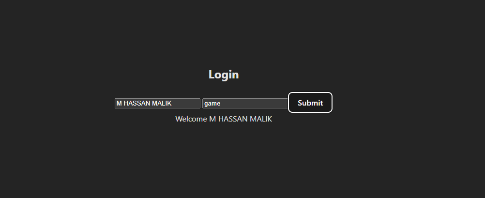

# Context  API

1. the first step of context state management is to create a context file where you createContext() see  UserContext.js file
2. has to create a provider with context so you can pass data second step UserContextProvider.jsx file
3. for whatever data is coming pass it forward for that we use word {children} in provider

## result

